# HOW TO IMPLEMENT CLIENT-SERVER-ARCHITECTURE-USING-MYSQL-DATABASE

## What is needed for the Project:

- An AWS account with administrative privileges
- Basic understanding of AWS services (EC2 Security Groups)
- Familiarity with Ubuntu Linux and SSH

### What is client server achitecture


Client-server architecture is a computing model where tasks are divided between servers and clients. In this architecture, clients request services or resources from servers, which fulfill these requests and return the results to the clients.


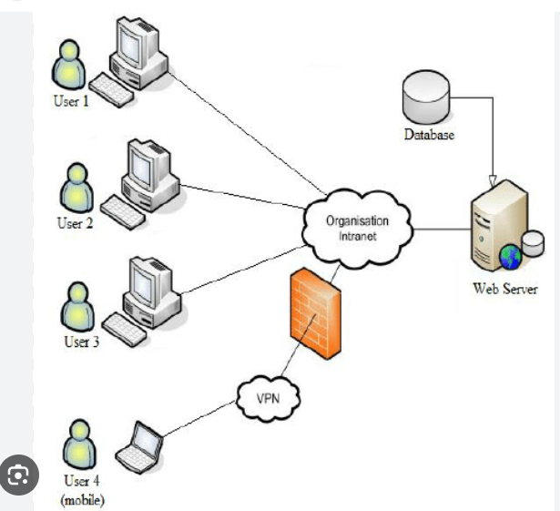

Here's a brief explanation of the components:

Client: A client is a device or application that initiates communication by sending requests to a server. Clients can be computers, smartphones, or other devices running client software.

Server: A server is a specialized computer or software application that provides services or resources to clients upon request. Servers are designed to handle multiple client requests simultaneously and efficiently process and fulfill these requests.

Communication: Clients and servers communicate with each other over a network using predefined protocols. The client sends requests to the server, which processes them and sends back responses containing the requested information or services.

Roles: Clients typically initiate requests for services or resources, while servers wait for and respond to client requests. Servers are responsible for storing and managing data, executing processes, and providing services, while clients are responsible for interacting with users and making requests to servers.

## Step by Step Implementation Guide:

### Step 1 - Set Up AWS EC2 instance and Configure the Security group

Create two security groups:
1. MySQL-client-sg: This group will only allow inbound SSH traffic on port 22. 

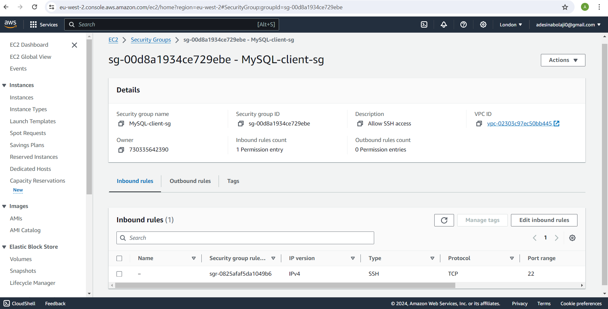

2. MySQL-server-sg: This security group will allow inbound SSH traffic on port 22 and MySQL traffic on port 3306 (only from the client machine's Private IP address to restrict database access). 

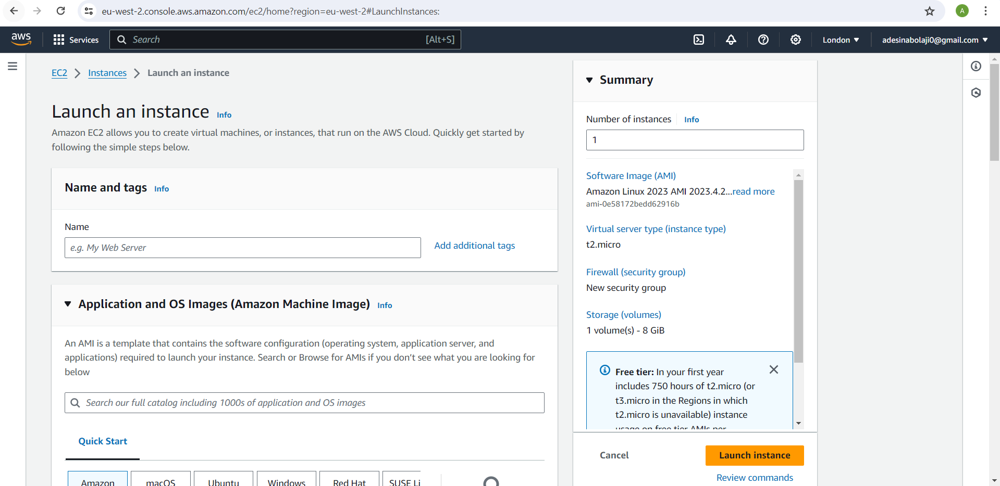

Launch two seperate instances one for MySQL server (database-server) the other for MySQL-client (client-machine). Choose Ubuntu distribution as the operating system. Associate the respective security groups (MySQL-client-sg and MySQL-server-sg) with each corresponding EC2 instance.

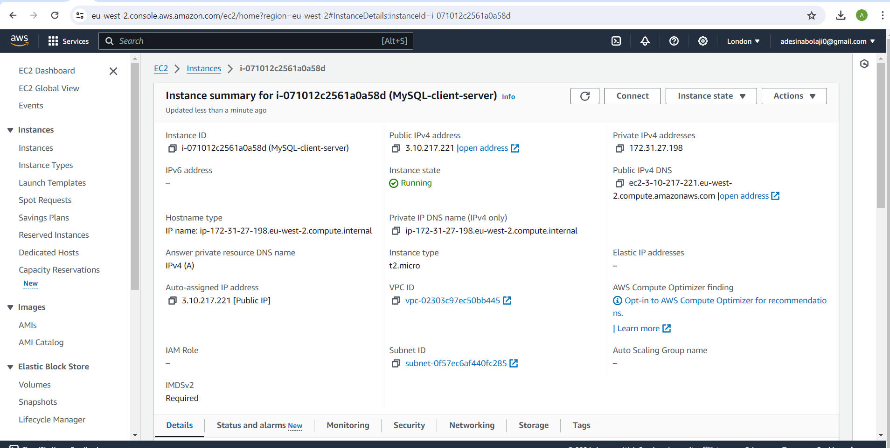
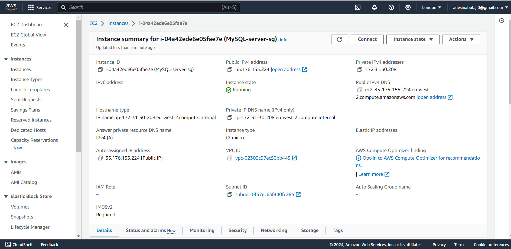

Launch and connect to both EC2 instances.  

### Step 2 - Install MySQL Server software on the mysql-server EC2 instance

Update package repository:

```
sudo apt update -y
```

Install MySQL Server

```
sudo apt install mysql-server -y
```

Start the MySQL service and enable it to start automatically at boot with : 

```
sudo systemctl start mysql

sudo systemctl enable mysql
```

Verify the status of Mysql service:

```
sudo systemctl status mysql
```

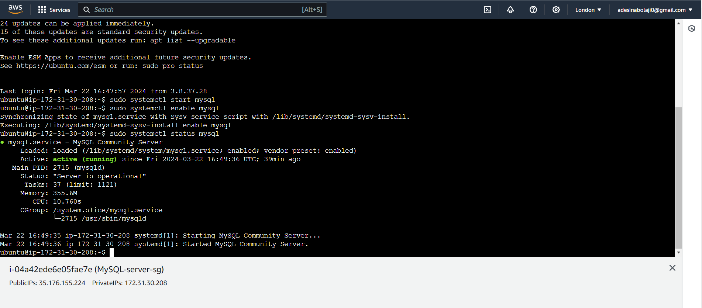

### Step 3 - Install MySQL Client Software on the MySQL-client EC2 Instance

Update package repository:

```
sudo apt update -y
```

Install MySQL Client 

```
sudo apt install mysql-client -y
```

### Step 4 - Configure MySQL Server Security, Create Database and User.

Connect to MySQL prompt on the mysql-server EC2 instance:

```
sudo mysql
```

Then run the following ALTER USER command to change the root user’s authentication method to one that uses a password.

```
ALTER USER 'root'@'localhost' IDENTIFIED WITH mysql_native_password BY 'password';
```

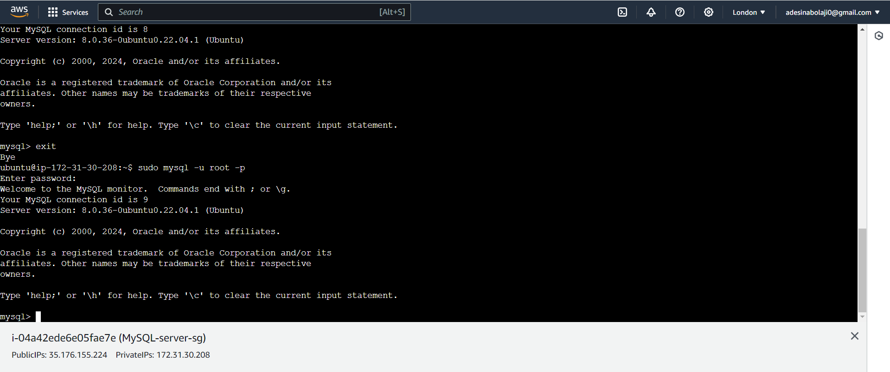

After making this change, exit the MySQL prompt:

```
exit
```

Log back into the mysql console using the root user, you will be prompted to input the password which is "habeeb" in this case.

```
sudo mysql -u root -p
```


Create a new database and user with privileges to access it. Below is a sample

```
CREATE DATABASE test_db;
```
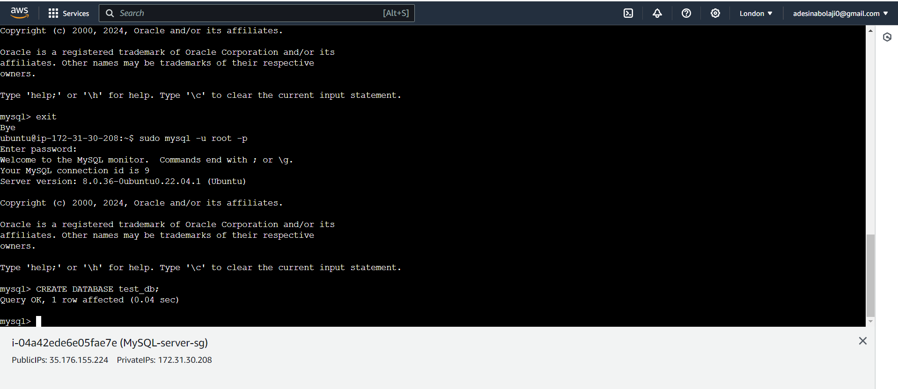
```
CREATE USER 'Revelation'@'%' IDENTIFIED BY 'password';
```
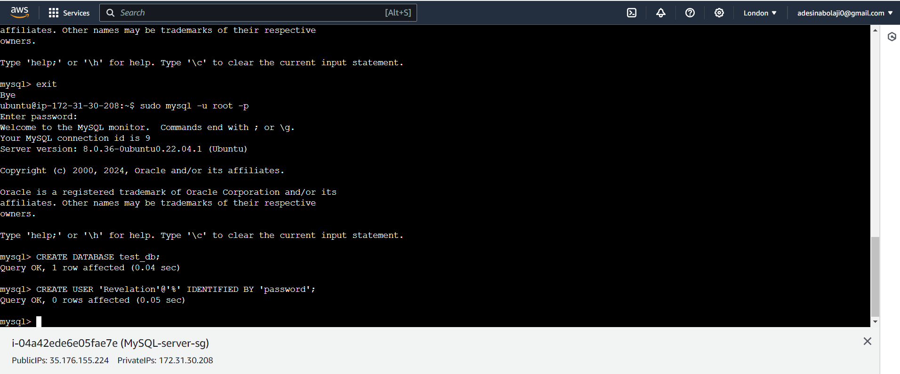
```
GRANT ALL PRIVILEGES ON test_db.* TO ''@'%';
```
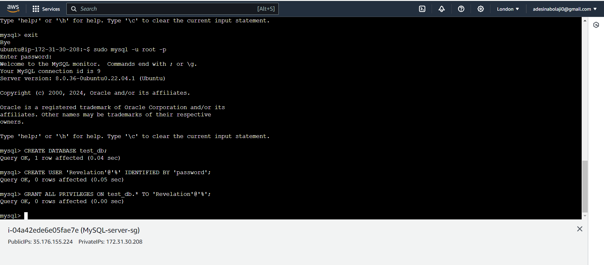 

```
FLUSH PRIVILEGES;
```
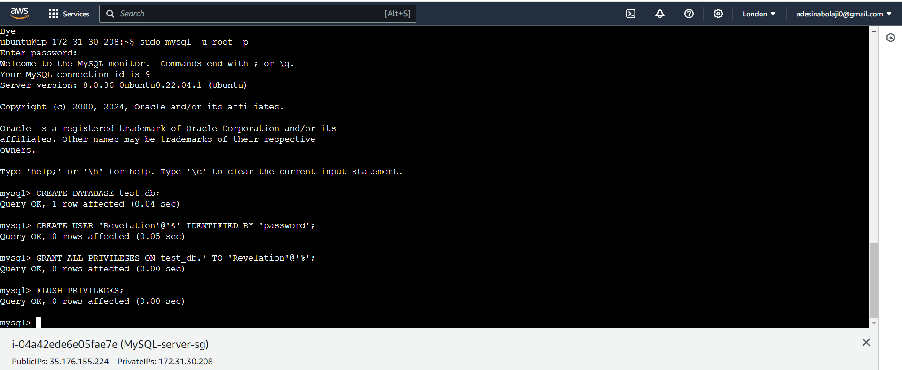

```
exit
```


### Step 5 - Configure MySQL server for Remote Access

Open the MySQL configuration file using a text editor:

```
sudo nano /etc/mysql/mysql.conf.d/mysqld.cnf
```

Find the line that starts with bind-address and change its value to 0.0.0.0 to listen on all interfaces:

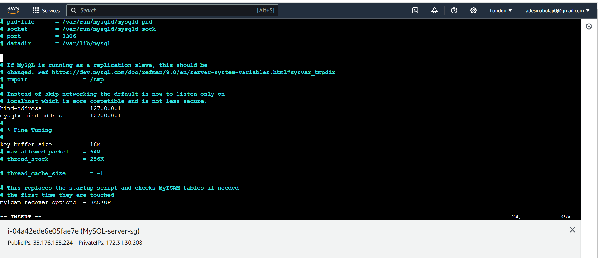

Restart the MySQL service for the changes to take effect:

```
sudo systemctl  restart mysql
```

### Step 6 - Connect to Mysql db server from the MySQL client

- Connect to the MySQL server from Mysql client and start querying the Mysql database from the client machine.

```
mysql -u username -h <MySQL-server-private-ip-address> -p
```

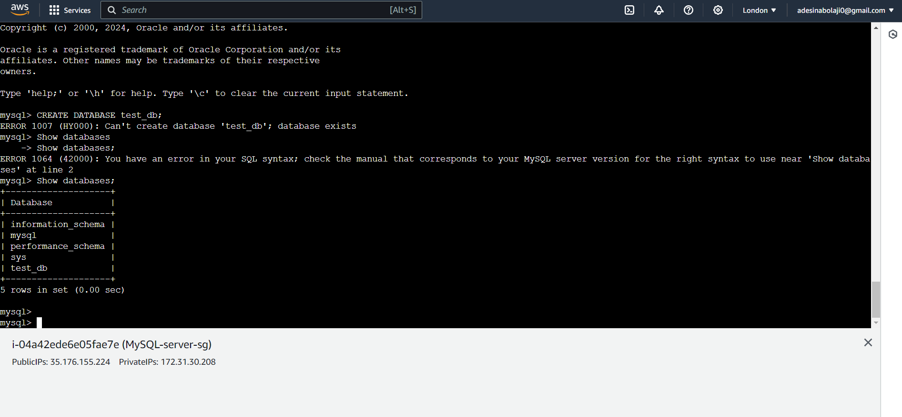

### Important Security Considerations:

- Strong Passwords: Always use complex passwords for root and user accounts.

- Minimize Remote Access: If possible, avoid enabling remote access to the MySQL server for enhanced security.

- Security Groups: Restrict access to the MySQL server using security groups, allowing connections only from authorized sources.

- Regular Updates: Keep your MySQL server and operating system software up-to-date with the latest security patches.

### Conclusion:

This guide has comprehensively explained how to build a client-server architecture using MySQL on AWS with Ubuntu Linux. We've learned about client-server principles, set up EC2 instances with security groups, installed and secured the MySQL server, and established a connection from the client to manage our database. Remember to prioritize security by implementing strong passwords, minimizing remote access, and keeping software updated.

**PROJECT COMPLETED**